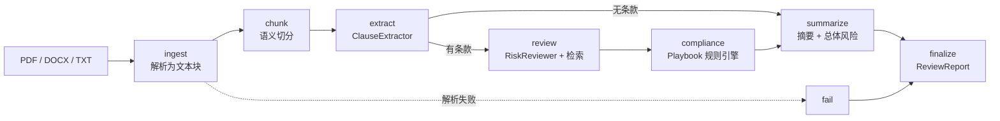

# LCR-Agent · 法律合同审查 Agent

> 基于 **LangGraph** 的合同审查智能体：把一份合同（PDF / DOCX / 文本）变成
> 「结构化条款 + 风险清单 + 合规结论 + 执行摘要」的可核验报告。
>
> Python 3.11 ｜ Poetry ｜ LangGraph ｜ FastAPI ｜ Pydantic v2 ｜ Chroma + BM25

---

## 目录

- [它解决什么问题](#它解决什么问题)
- [核心设计](#核心设计)
- [架构与数据流](#架构与数据流)
- [目录结构](#目录结构)
- [快速开始](#快速开始)
- [配置说明](#配置说明)
- [API 一览](#api-一览)
- [常用命令](#常用命令)
- [测试](#测试)
- [路线图](#路线图)

---

## 它解决什么问题

法务审一份合同通常要做四件事：**读懂条款结构 → 逐条找风险 → 对照内部红线 → 写结论**。
本项目把这条链路拆成可独立测试、可替换的 Agent 节点，用 LangGraph 编排成一张有状态的图，
并在每个环节都保留**可回溯的证据**（字符偏移、页码、检索到的先例）。

与传统「一个大 prompt 丢给 LLM」的做法相比，本项目的差异在于：

| 维度 | 单 prompt 方案 | 本方案 |
| --- | --- | --- |
| 条款定位 | 靠模型复述，无法回溯 | 规则切分保留 `char_start/char_end` |
| 结论依据 | 无 | 检索 CUAD 先例 + playbook 红线，写入 `citations` |
| 合规判定 | 不稳定 | 确定性正则规则引擎，可复现、可审计 |
| 可测试性 | 难 | Agent 无状态，桩模型即可全链路测试 |
| 成本 | 全文重复进上下文 | 分条款批量调用 + 仅在需要时检索 |

## 核心设计

**1. 分层解耦，单向依赖**

```
schemas  ←  parsing  ←  knowledge  ←  agents  ←  graph  ←  api
```

`schemas` 只依赖 pydantic，是全项目共享的契约层；`api` 只调用 `graph.run_review()`。
任何一层都可以被替换而不影响其它层（例如把 `knowledge` 换成 Elasticsearch）。

**2. Agent 无状态**

每个 Agent 的签名都是 `run(state: dict) -> dict`，输入输出都是图状态。
好处：可单测、可重放、可并行，也天然支持 LangGraph 的 checkpointer 与人机协同（HITL）。

**3. 规则先行，LLM 兜底增强**

条款抽取先用正则定位边界（保证不丢、不越界），再让 LLM 分类；
LLM 不可用时自动回退到关键词规则，链路不会中断。合规检查则完全用确定性规则。

**4. 混合检索 + RRF 融合**

`BM25（稀疏）` 与 `Chroma（稠密）` 两路召回，用 Reciprocal Rank Fusion 融合：

$$\text{score}(d) = \sum_{r \in \{\text{bm25},\ \text{vector}\}} \frac{w_r}{k + \text{rank}_r(d)},\quad k = 60$$

RRF 不依赖两路分数的量纲，比线性加权更稳健。

## 架构与数据流



每个节点都会往 `state["trace"]` 追加一条带耗时的记录，最终进入报告，便于观测与调优。

## 目录结构

```
LCR-Agent/
├── pyproject.toml              # Poetry 依赖 + ruff / mypy / pytest 配置
├── Makefile                    # make dev / make test / make run
├── .env.example                # 环境变量模板
├── .python-version             # 3.11
├── README.md
│
├── configs/                    # 实验配置
│   ├── default.yaml            # 主配置（解析 / 检索 / Agent 行为）
│   ├── playbook.yaml           # 合规红线规则（必备条款 + 禁止/必备表述）
│   └── retrieval.yaml          # 检索实验配置（含消融实验定义）
│
├── data/
│   ├── cuad/                   # CUAD 数据集（原始 JSON 不入 git）
│   │   ├── README.md
│   │   └── .gitkeep
│   └── index/                  # 派生索引（BM25 pkl + Chroma，不入 git）
│
├── src/
│   ├── config.py               # 全局配置（pydantic-settings）
│   ├── parsing/                # 文档解析
│   │   ├── __init__.py         # 解析器注册表 + parse_document / parse_bytes
│   │   ├── base.py             # BaseParser、标题识别、文本归一化
│   │   ├── pdf_parser.py       # pdfplumber：正文 + 表格
│   │   ├── docx_parser.py      # python-docx：段落 + 表格（保序）
│   │   ├── text_parser.py      # txt / markdown
│   │   └── chunker.py          # token 感知切分（tiktoken）
│   ├── schemas/                # Pydantic 数据模型（契约层）
│   │   ├── document.py         # TextBlock / ParsedDocument / Chunk
│   │   ├── clause.py           # ClauseType / Clause / ClauseCoverage
│   │   ├── retrieval.py        # Corpus / RetrievalQuery / RetrievedPassage
│   │   ├── review.py           # RiskIssue / ComplianceResult / ReviewReport
│   │   └── api.py              # 请求 / 响应模型
│   ├── knowledge/              # 知识库与检索
│   │   ├── base.py             # PassageRecord / Retriever 协议
│   │   ├── embeddings.py       # sentence-transformers（含 hashing 离线后端）
│   │   ├── vectorstore.py      # Chroma 封装
│   │   ├── bm25.py             # rank_bm25 + 中英文分词 + 持久化
│   │   ├── retriever.py        # HybridRetriever（RRF 融合）
│   │   └── cuad_loader.py      # CUAD 加载 + 41 类目映射
│   ├── agents/                 # Agent 定义
│   │   ├── base.py             # BaseAgent：检索增强 + 结构化输出 + 降级
│   │   ├── llm.py              # LLM 工厂（OpenAI 兼容 / 离线 stub）
│   │   ├── clause_extractor.py # 规则切分 + LLM 分类
│   │   ├── risk_reviewer.py    # 逐条款风险审查（带证据引用）
│   │   ├── compliance_checker.py # playbook 确定性规则引擎
│   │   └── summarizer.py       # 摘要 + 总体风险等级
│   ├── graph/                  # LangGraph 编排
│   │   ├── state.py            # ReviewState（含 reducer 定义）
│   │   ├── nodes.py            # 节点工厂 + 条件路由
│   │   └── builder.py          # build_review_graph / run_review
│   └── api/                    # FastAPI 接口
│       ├── main.py             # create_app / lifespan / CORS
│       ├── deps.py             # 依赖注入（图 / 检索器 / 报告仓库）
│       ├── store.py            # 报告仓库（LRU，可替换为 DB）
│       └── routes/
│           ├── health.py       # /health /ready
│           └── review.py       # /reviews CRUD + 文件上传
│
├── scripts/
│   ├── download_cuad.py        # 下载 CUAD 数据集
│   ├── build_index.py          # 构建 BM25 + 向量索引
│   └── run_review.py           # 命令行审查入口（可接 CI 门禁）
│
└── tests/
    ├── conftest.py             # 夹具与环境隔离
    ├── stubs.py                # 测试替身（桩 LLM / 桩图 / 样例合同）
    ├── test_parsing.py
    ├── test_retrieval.py
    ├── test_agents.py
    ├── test_graph.py
    └── test_api.py
```

> **关于 `src/` 布局**：本项目采用 *flat src layout* —— `src/` 下的每个子目录都是一个
> 顶层包，因此导入写法是 `from parsing import parse_document`、`from graph import run_review`。
> Poetry 通过 `packages = [{ include = "parsing", from = "src" }, ...]` 把它们安装为
> 可编辑包，pytest 则通过 `pythonpath = ["src"]` 对齐同一套导入路径。

## 快速开始

### 1. 准备环境

```bash
# 前置：Python 3.11+、Poetry 1.8+
python --version
poetry --version

# 安装依赖（含 dev）
make install
# 或
poetry install --with dev
```

### 2. 配置环境变量

```bash
cp .env.example .env
# 编辑 .env，至少填 OPENAI_API_KEY 与 OPENAI_BASE_URL
# 未配置密钥也能启动：LLM 会退化为离线 stub，便于先跑通链路
```

### 3. 准备数据与索引

```bash
make download-cuad          # 下载 CUAD 到 data/cuad/
make index                  # 构建 BM25 + 向量索引（首次会下载向量模型）

# 想先快速验证？只建 BM25、只处理 30 份合同：
python scripts/build_index.py --limit 30 --no-vector
```

### 4. 启动服务

```bash
make run                    # 热重载开发模式
# 打开 http://localhost:8000/docs
```

### 5. 跑一次审查

```bash
# 命令行
python scripts/run_review.py data/samples/contract.docx --format markdown --output report.md

# HTTP
curl -X POST http://localhost:8000/api/v1/reviews/upload \
  -F "file=@contract.pdf" -F "use_retrieval=true"
```

## 配置说明

配置分三层，优先级从高到低：

1. **环境变量 / `.env`** —— 敏感信息与部署差异（密钥、路径、端口）；
2. **`configs/*.yaml`** —— 行为参数与实验设置；
3. **代码内默认值** —— `src/config.py` 中的字段默认值。

关键环境变量（完整列表见 `.env.example`）：

| 变量 | 默认值 | 说明 |
| --- | --- | --- |
| `OPENAI_API_KEY` | 空 | 为空时自动降级为离线 stub |
| `OPENAI_BASE_URL` | OpenAI 官方 | 可指向 DeepSeek / Qwen / vLLM |
| `LCR_LLM_MODEL` | `gpt-4o-mini` | 模型名 |
| `LCR_EMBEDDING_MODEL` | `BAAI/bge-m3` | 中文场景推荐 bge 系列 |
| `LCR_EMBEDDING_BACKEND` | `sentence-transformers` | 设为 `hashing` 可离线跑测试 |
| `LCR_CHROMA_DIR` | `./data/index/chroma` | 向量库目录 |
| `LCR_TOP_K` | `5` | 最终返回的检索条数 |
| `LCR_CHUNK_SIZE` | `800` | chunk token 上限 |

`configs/playbook.yaml` 是最需要按业务定制的文件：它声明**必备条款**与**红线规则**
（禁止表述 / 必备表述的正则），合规检查 Agent 直接消费它，无需改代码即可调整审查标准。

## API 一览

| 方法 | 路径 | 说明 |
| --- | --- | --- |
| `GET` | `/` | 服务元信息 |
| `GET` | `/api/v1/health` | 存活探针（含 LLM / 索引摘要） |
| `GET` | `/api/v1/ready` | 就绪探针（索引未建则返回 `degraded`） |
| `POST` | `/api/v1/reviews` | 提交纯文本合同，同步返回报告 |
| `POST` | `/api/v1/reviews/upload` | 上传 PDF / DOCX / TXT / MD |
| `GET` | `/api/v1/reviews` | 分页列出历史报告摘要 |
| `GET` | `/api/v1/reviews/{report_id}` | 获取单份报告 |
| `DELETE` | `/api/v1/reviews/{report_id}` | 删除报告 |

示例响应（截断）：

```jsonc
{
  "report_id": "rpt_r7c1...",
  "status": "succeeded",
  "overall_risk": "critical",
  "report": {
    "contract_type": "技术服务合同",
    "summary": "本次共识别条款 10 条，合规规则通过率 45%……",
    "clauses": [{"clause_id": "doc_x-cl0005", "type": "liability", "confidence": 0.92}],
    "issues": [
      {
        "severity": "critical",
        "category": "compliance_risk",
        "title": "合规规则未通过：LIA-002",
        "suggestion": "删除完全免责表述，改为赔偿直接损失并设置合理责任上限。",
        "citations": [{"corpus": "cuad", "ref": "NDA · Cap On Liability", "score": 0.83}]
      }
    ],
    "stats": {"num_clauses": 10, "num_issues": 7, "coverage_ratio": 0.8},
    "trace": [{"node": "ingest", "latency_ms": 12}, {"node": "extract", "latency_ms": 8300}]
  }
}
```

## 常用命令

```bash
make help          # 列出所有目标
make install       # 安装依赖（含 dev）
make dev           # 安装依赖 + 热重载启动 API
make run           # 热重载启动 API
make run-prod      # 多 worker 启动
make test          # 运行全部测试
make test-unit     # 跳过 integration / slow 标记
make test-cov      # 测试 + 覆盖率（htmlcov/）
make lint          # ruff check
make fmt           # ruff format + 自动修复
make typecheck     # mypy src
make check         # fmt-check + typecheck + test（提交前自检）
make download-cuad # 下载 CUAD
make index         # 构建检索索引
make clean         # 清理缓存与测试产物
```

Windows 用户：Makefile 依赖 GNU Make，可通过 `choco install make` 安装，
或在 Git Bash / WSL 中执行；也可以直接运行上表中对应的 Poetry 命令。

## 测试

```bash
make test-unit     # 快：全部使用桩模型与 hashing 向量后端，不联网
make test          # 含 integration 标记的用例（需要 chromadb 等真实依赖）
```

测试策略：

- `tests/stubs.py` 提供 `ScriptedChatModel`（可脚本化结构化输出）与 `FakeCompiledGraph`；
- `tests/conftest.py` 在导入项目模块**之前**注入测试环境变量，避免污染真实配置；
- API 测试通过 `dependency_overrides` 替换图与检索器，并刻意不进入 `TestClient`
  的 `with` 块以跳过 lifespan 预热。

## 路线图

- [ ] **条款抽取评测**：用 CUAD 律师标注计算 entity-level F1，固化回归基线
- [ ] **Playbook 可视化**：把 `playbook.yaml` 做成可编辑的规则管理界面
- [ ] **HITL 复核**：利用 LangGraph `interrupt_before` 实现「高风险条款人工确认后继续」
- [ ] **多轮谈判建议**：基于风险项生成 redline（修订对照版）文档
- [ ] **报告持久化**：`InMemoryReportStore` 替换为 SQLite / Postgres
- [ ] **异步任务**：长合同改为后台任务 + 轮询 / SSE 推送进度
- [ ] **多法域支持**：法条库（中国《民法典》/ GDPR 等）作为独立 corpus 接入检索

## 许可

MIT。CUAD 数据集采用 CC BY 4.0，使用时请注明 The Atticus Project。
